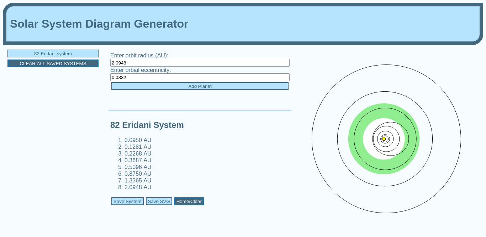

# Solar System Diagram Generator

Generate an SVG diagram of a custom solar system using HTML and JavaScript.

## Functionality / Usage

Using data for a fictional solar system, this application creates a diagram showing the orbits of each planet input as well as the habitable zone for the system.

To use the application, you need the luminosity of the parent star (where the luminosity of the sun = 1.0), the orbital radius of each planet in AU, and (optionally) the eccentricity of each orbit.  (If not given, eccentricity of 0, i.e. perfectly circular orbits, are assumed).

The scale used in the diagram is 1 pixel = 0.01 AU.

The habitable zone used is based on the work of Stephen Dole in *Habitable Planets for Man* in 1964 ([PDF](https://www.rand.org/pubs/commercial_books/CB179-1.html)).  (While dated, I have used these definitions for *years* and the constants are burned into my brain at this point, so I have used them here.)  Thus, the zone displayed shows an inner limit of 1.9 times the solar insolation received by the Earth, and an outer limit of 0.65 times.  The limits are calculated as SQRT(luminosity / 1.9) and SQRT(luminosity / 0.65); for our solar system, 0.725 to 1.240 AU.

## Mock-Up

The following screenshot shows the app as it is in use:

Additionally, the system diagram produced in the screenshot above can be found [here](./assets/82_Eridani_system_download.svg).

## Deployed Application

A live version of the application can be found [here](https://giancarlow333.github.io/solar-system-diagrammer).

## Future Development

Planned future developments include:

* Multiple/custom definitions of the habitable zone.
* Rotating elliptical orbits to simulate arguments of periapsis.
* Editing/deleting selected planets from a saved system.
* Deleting selected saved systems, instead of all of them at once.
* Resizing the window when a planet is input that has an orbital radius of more than 2.5 AU.
* Adding labels to each planet.
* Support for asteroid belts.
* Support for multiple and circumbinary star systems.

## Sources

* [This StackOverflow thread](https://stackoverflow.com/questions/22894540/creating-circles-with-svg-and-javascript) explained how to add SVG elements via JavaScript.  Hats off to [Sirko](https://stackoverflow.com/users/1169798/sirko) in particular!
* I consulted [this StackOverflow thread](https://stackoverflow.com/questions/47845210/check-if-exist-any-key-localstorage-javascript) and [this one](https://stackoverflow.com/questions/17745292/how-to-retrieve-all-localstorage-items-without-knowing-the-keys-in-advance) for checking if anything is in localStorage and for selecting items from it without knowing the keys in advance.
* I consulted [this thread](//https://stackoverflow.com/questions/10291017/how-to-get-id-of-button-user-just-clicked) about getting the id of a button clicked by a user, and in particular [jlaceda](https://stackoverflow.com/users/1332190/jlaceda)'s answer.
* The code for downloading the SVG file created by the program is copied wholesale from [this StackOverflow thread](https://stackoverflow.com/questions/60241398/how-to-download-and-svg-element-as-an-svg-file) and was written by user [Alex L](https://stackoverflow.com/users/9792594/alex-l).

## License

This app is licensed under the [MIT License](https://choosealicense.com/licenses/mit/).

---

(c) 2023 Giancarlo Whitaker
